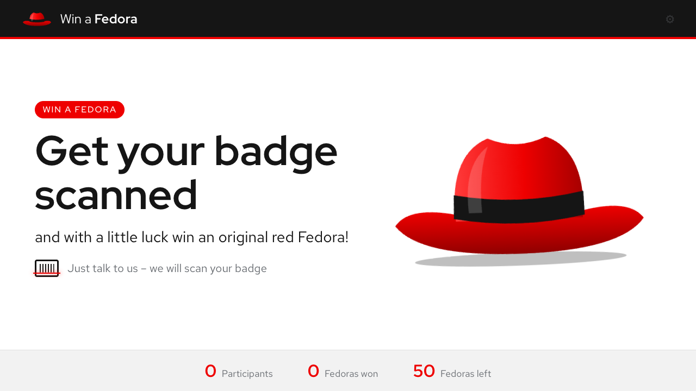
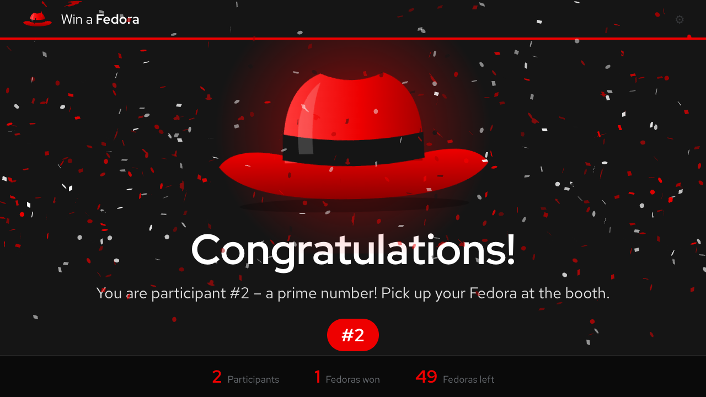
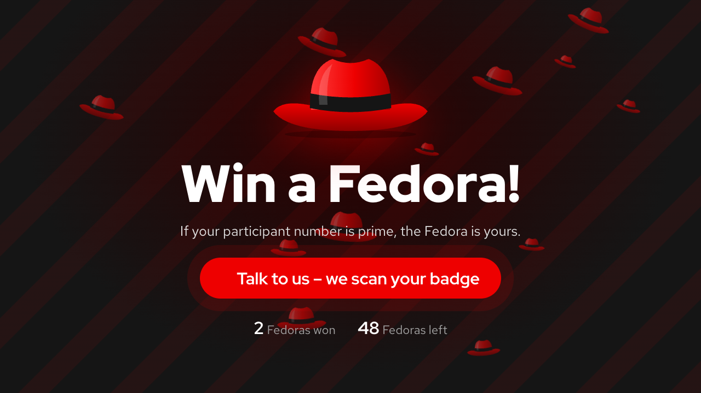
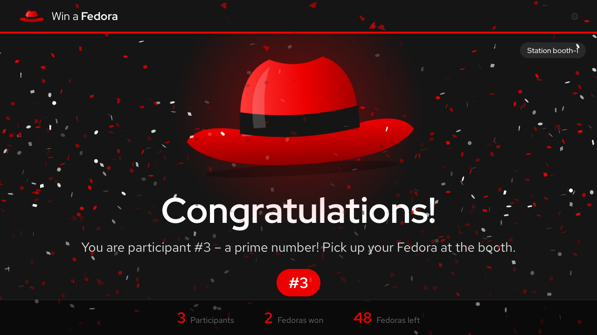
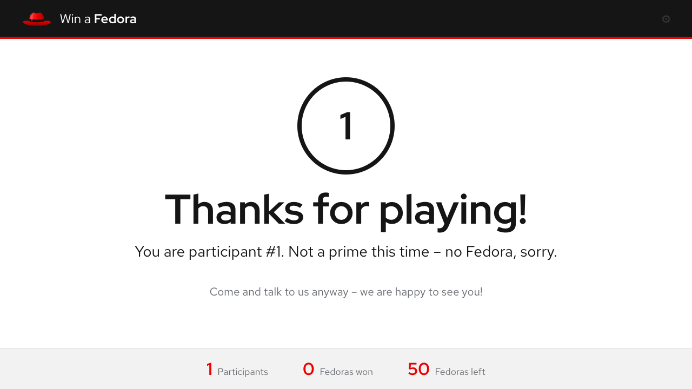
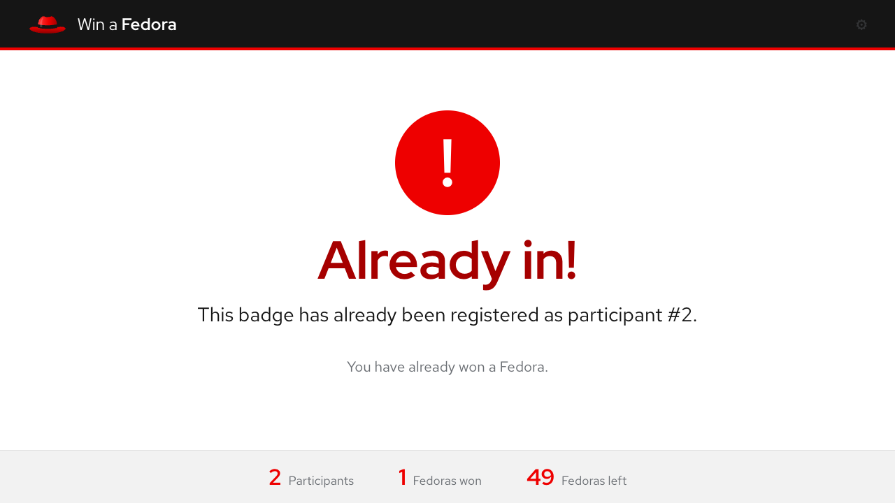
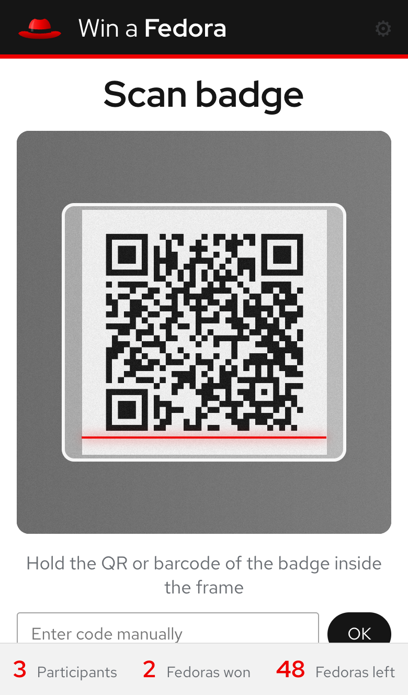
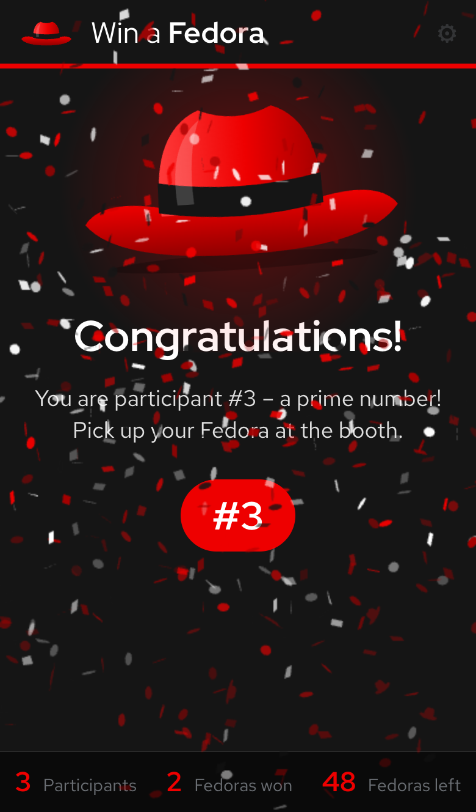
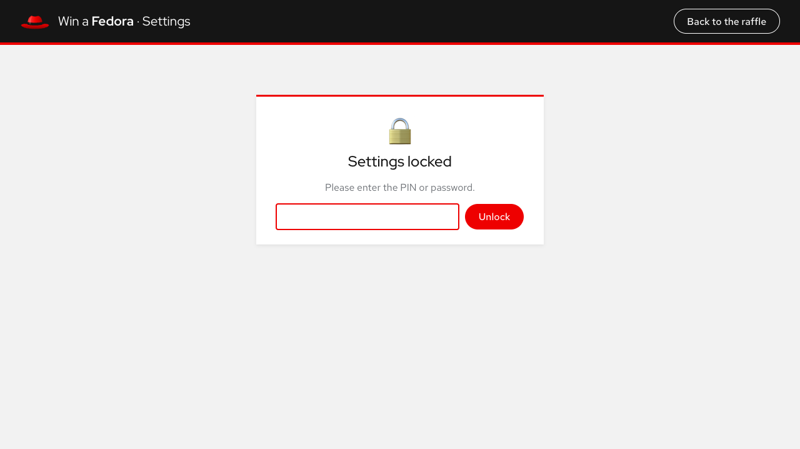
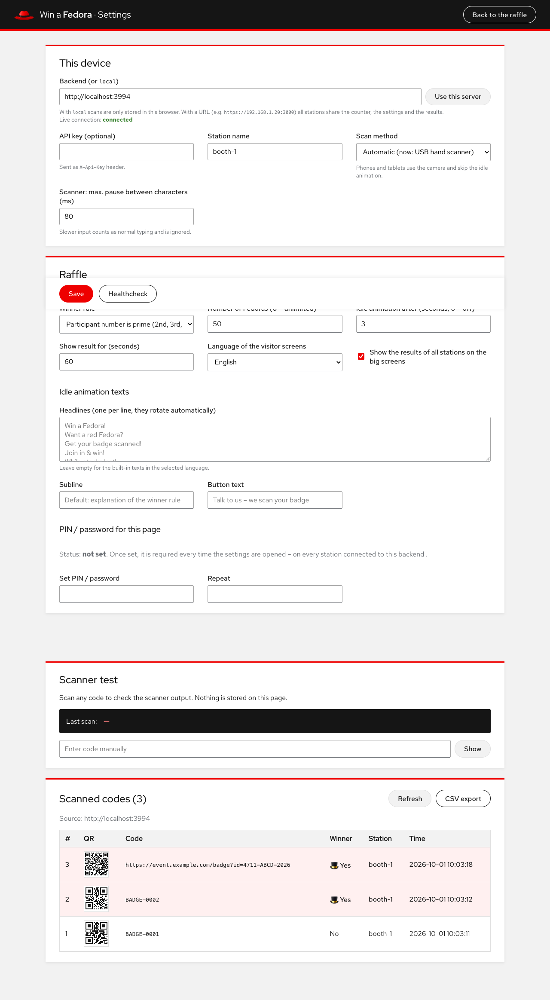

# Win a Fedora 🎩

A raffle for your trade show booth: the booth staff scans the visitor's badge with a barcode/QR
scanner. If the participant number is a **prime number** (or the person is drawn at **random**),
they win a red **Fedora** – with confetti and flying Fedoras. Every badge can take part only once.

Runs entirely in the browser (Angular), optionally with a small Node backend through which any
number of scan stations (laptops with a USB hand scanner, phones and tablets with their camera)
share one counter, the settings and the results.

## Screenshots

| Start screen (PC with USB hand scanner)           | Winner: confetti and flying Fedoras                             |
| ------------------------------------------------- | --------------------------------------------------------------- |
|  |                        |
| **Idle animation** draws visitors to the booth    | **Live result** from another station (here: a phone)            |
|    |  |
| **Not a prime** – no Fedora this time             | **Duplicate scan** is detected                                  |
|         |               |

| Phone: camera scan                                                                     | Phone: winner                                                                  | Settings locked with a PIN                             |
| -------------------------------------------------------------------------------------- | ------------------------------------------------------------------------------ | ------------------------------------------------------ |
|  |  |  |

<details>
<summary>Settings page (full page)</summary>



</details>

## Features

- **Kiosk view** (`/#/`) in the Red Hat look and feel (Red Hat Display/Text, #EE0000, black/white)
- **Barcode scanner as keyboard**: fast input followed by Enter counts as a scan, normal typing is
  ignored
- **Camera scanning on phones and tablets**: iPhone, iPad and Android are detected and scan QR codes
  and barcodes with the back camera (manual input as a fallback). The idle animation is skipped
  there.
- **Vibration on phones**: a long buzz for a winner, a short one when a code is recognised, a double
  buzz for duplicates and errors
- **Multiple stations**: the backend hands out the participant numbers centrally (never twice),
  pushes settings changes to every station right away and shows results live on all big screens
- **Duplicate detection**: badges that were already scanned are not counted again, a notice is shown
- **Winner animation**: the Fedora flies in, confetti in Red Hat colours, Fedoras rain from the sky
- **Idle/attract mode**: after X seconds without a scan an animation draws visitors to the booth;
  headlines, subline and button text can be changed in the settings
- **Fedora stock**: optional limit on the number of Fedoras, then “all Fedoras are gone”
- **Settings page** (`/#/config`, like in [bashbrawl](https://github.com/jggoebel/bashbrawl)):
  - _This device_: backend URL, API key, station name, scan method (automatic/USB/camera)
  - _Raffle_ (stored in the backend, the same for all stations): winner rule, number of Fedoras,
    timings, language of the visitor screens (English/German), idle texts, show results of other
    stations, PIN/password
  - Health check, scanner test, list of all scanned codes (also as QR codes), CSV export
- **PIN/password for the settings**: once set, it is required every time the settings are opened
  (with a backend on all stations; stored as a scrypt hash, 5 wrong attempts → 30 s lockout)
- **Backend** without dependencies (`server/server.mjs`): stores scans and settings as JSON files

## Quick start at the booth (one laptop)

```bash
npm ci
npm run start:booth          # builds the frontend and starts the backend on port 3000
```

Then open <http://localhost:3000> in the browser (full screen: F11). When the app is served by the
backend it connects to it automatically on first start. From now on every scan ends up in
`server/data/scans.json`, the settings in `server/data/config.json`.

Without a backend (`local`, e.g. with the dev server) scans are only stored in the browser's local
storage.

## Multiple stations and phones

1. Start the backend on a laptop in the booth Wi-Fi – **with HTTPS**, because browsers only allow
   the camera over HTTPS (exception: `localhost`):

   ```bash
   # create a certificate once (put in the laptop's IP address)
   openssl req -x509 -newkey rsa:2048 -nodes -days 60 -keyout server/data/key.pem \
     -out server/data/cert.pem -subj "/CN=hat-raffle" \
     -addext "subjectAltName=IP:192.168.1.20,DNS:localhost"

   npm run build
   TLS_CERT=server/data/cert.pem TLS_KEY=server/data/key.pem npm run server
   ```

   Certificates made with [mkcert](https://github.com/FiloSottile/mkcert) avoid the browser warning
   once the mkcert CA is installed on the devices. Otherwise confirm the warning once on each device
   (“Show details → visit this website” or “Advanced → Proceed”).

2. Open `https://192.168.1.20:3000` on every device. The app connects to the backend
   automatically. Give each device a unique **station name** in the settings.
3. Laptops/PCs use the USB hand scanner and show the idle animation. Phones and tablets open the
   camera straight away. The scan method can be overridden per device in the settings.
4. When someone wins at one station, the result with confetti also appears on all big screens
   (with the station name). Can be turned off with _Show the results of all stations_.
5. Settings saved on one station are picked up by all others immediately.

The participant numbers are only handed out by the backend: Node handles the requests one after
another, and assigning the number and storing the scan happen without interruption. So even with
simultaneous scans at several stations nobody gets the same number (see the test _many stations at
once never get the same number_). Therefore only **one** backend instance may run.

### Camera scanning

- Android (Chrome) uses the browser's built-in barcode detector.
- iOS has no built-in detector in the browser, so [ZXing](https://github.com/zxing-js/library) is
  used. It decodes small, downscaled parts of the camera picture and cycles through different crops
  and sizes from frame to frame. This finds badge codes much faster than decoding full frames.
- The camera is opened in HD with continuous autofocus where the device supports it.
- Hold the badge so the code is roughly inside the frame. A badge that stays in front of the camera
  is not sent a second time; tapping the result goes straight back to the camera.

### Vibration

- **Android**: Chrome only allows vibration after the screen has been touched once. Until then the
  scan screen shows “Tap once to enable vibration”.
- **iPhone/iPad**: Safari has no vibration API. From iOS 18 on the app uses the haptic feedback of a
  hidden switch control instead, so a win is felt as a series of taps. This requires
  _Settings → Sounds & Haptics → System Haptics_ to be on; older iOS versions do not vibrate.

## Development

```bash
npm start                    # Angular dev server on http://localhost:4200
npm run server               # backend on http://localhost:3000
npm test                     # frontend tests (Vitest)
npm run test:server          # backend tests (node:test)
```

To test without a scanner: normal typing is ignored on purpose. Temporarily set _Scanner: max.
pause between characters_ in the settings to e.g. `1000` ms, then you can type a code on the kiosk
and submit it with Enter.

## Winner rule

| Rule                | Description                                                                                                                    |
| ------------------- | ------------------------------------------------------------------------------------------------------------------------------ |
| `counter` (default) | The n-th person wins if n is a prime number (2nd, 3rd, 5th, 7th, 11th, …).                                                     |
| `code`              | All digits of the scanned code are read as one number and checked for being prime.                                             |
| `random`            | Random: in every block of 100 scans (1–100, 101–200, …) exactly _Fedoras per 100 scans_ winners are drawn at random positions. |

In backend mode the server hands out the participant numbers, so several stations share one
counter.

## Backend

Configured with environment variables:

| Variable              | Default                            | Description                                                                     |
| --------------------- | ---------------------------------- | ------------------------------------------------------------------------------- |
| `PORT`                | `3000`                             | Port                                                                            |
| `DATA_FILE`           | `server/data/scans.json`           | File with all scans                                                             |
| `CONFIG_FILE`         | next to `DATA_FILE`: `config.json` | Shared settings and PIN hash                                                    |
| `API_KEY`             | –                                  | If set, every `/api` request must send the header `X-Api-Key` (events: `?key=`) |
| `CORS_ORIGIN`         | `*`                                | Allowed origin                                                                  |
| `STATIC_DIR`          | `dist/hat-raffle/browser`          | Serves the built frontend as well                                               |
| `TLS_CERT`, `TLS_KEY` | –                                  | Paths to certificate and key (PEM) – turns on HTTPS                             |
| `TRUST_PROXY`         | –                                  | `1` behind a reverse proxy: `X-Forwarded-For` is used for the PIN lockout       |

### API

| Method | Path                 | Description                                                                                                                                                                    |
| ------ | -------------------- | ------------------------------------------------------------------------------------------------------------------------------------------------------------------------------ |
| `GET`  | `/healthz`           | Health check `{ status: "ok", app: "hat-raffle" }`                                                                                                                             |
| `POST` | `/api/scans`         | Body `{ code, station, clientId }` → `201 { status: "new", record, soldOut }` or `200 { status: "duplicate", record }`. The winner rule always comes from the shared settings. |
| `GET`  | `/api/stats`         | `{ total, winners }`                                                                                                                                                           |
| `GET`  | `/api/config`        | Shared settings incl. `pinSet` (without the PIN)                                                                                                                               |
| `PUT`  | `/api/config` 🔒     | Body `{ config, newPin? }` (`newPin: null` removes the PIN)                                                                                                                    |
| `POST` | `/api/config/unlock` | Body `{ pin }` → `200` or `403`, after 5 wrong attempts `429`                                                                                                                  |
| `GET`  | `/api/events`        | Server-Sent Events: `hello` (settings + counters), `scan` (new scan without the code), `config`                                                                                |
| `GET`  | `/api/scans` 🔒      | All scans `{ scans, total, winners }`                                                                                                                                          |
| `GET`  | `/api/scans.csv` 🔒  | CSV export (PIN also as `?pin=`)                                                                                                                                               |

🔒 = needs the header `X-Config-Pin` once a PIN is set. Scanning and the kiosk screens work without
the PIN.

A record looks like this:

```json
{
  "code": "BADGE-0002",
  "number": 2,
  "winner": true,
  "station": "booth-1",
  "timestamp": "2026-10-25T09:12:00.000Z"
}
```

### Docker

There are three images:

| File                  | Contents                                                                              |
| --------------------- | ------------------------------------------------------------------------------------- |
| `server/Dockerfile`   | only the **backend** (API, shared settings, live events), port 3000                   |
| `Dockerfile.frontend` | only the **frontend** (nginx), forwards `/api` and `/healthz` to the backend, port 80 |
| `Dockerfile`          | all in one: the backend also serves the frontend, port 3000                           |

**Backend and frontend separately (docker compose):**

```bash
docker compose up -d --build        # frontend: http://<host>:8080, backend: port 3000
```

All stations open `http://<host>:8080`. The frontend connects to the backend automatically through
the nginx proxy. Scans and settings are kept in the volume `raffle-data`. An API key is set in a
`.env` file next to `docker-compose.yml` (`API_KEY=secret`).

**Backend only:**

```bash
docker build -t hat-raffle-backend server
docker run -d -p 3000:3000 -v raffle-data:/data hat-raffle-backend
```

Then point the frontend (wherever it runs) to `http://<host>:3000` in the settings.

**All in one container:**

```bash
docker build -t hat-raffle .
docker run -p 3000:3000 -v $(pwd)/data:/data -e API_KEY=secret hat-raffle
```

The phone camera needs HTTPS: either set `TLS_CERT`/`TLS_KEY` on the backend (mount the
certificates as a volume) or put a reverse proxy with TLS in front of the frontend.

## Tips for the trade show

- Start the browser in kiosk mode, e.g. `chromium --kiosk http://localhost:3000`.
- Phones: extend the auto-lock time for the show and add the page to the home screen.
- The scanner must be set up as a USB keyboard (HID) and end each code with **Enter** (or Tab). If
  characters come out wrong (e.g. z/y swapped, special characters), set the scanner's keyboard
  layout to match the computer's.
- The visitor screens are English by default; German can be chosen under _Language of the visitor
  screens_ in the settings.
- Badge codes can contain personal data – put up a privacy notice at the booth and delete
  `scans.json` after the show and the prize hand-out. The live events sent to the stations contain
  no codes, only number, station and result.
- The local PIN (without a backend) is kept in the browser only. It prevents accidental changes,
  not someone with access to the developer tools.
- The red Fedora is our own drawing, not an official Red Hat logo.
